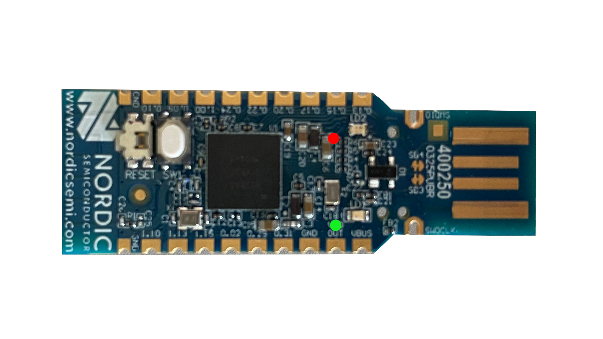

# Attestation process on PC Engines apu2

## Prerequirements

- System image from [meta-fobnail](https://github.com/fobnail/meta-fobnail)
  repository flashed on SD card
- TPM module connected to PC Engines apu2
- Fobnail Token with Fobnail Firmware from
  [fobnail-apu-test](https://github.com/fobnail/fobnail/tree/fobnail-apu-test)
  branch

## Attestation workflow

1. Boot [meta-fobnail](https://github.com/fobnail/meta-fobnail) image in DLME -
   this was described [here](../docs/meta-fobnail-in-dlme.md).

2. Run attestation server

```
# fobnail-attester
Creating CoAP server endpoint using UDP.
Registering CoAP resources.
Entering main loop.
```

3. Connect Fobnail Token to PC Engines apu2. If device is detected properly
   system should print following information

```
usb 2-2: new full-speed USB device number 11 using xhci_hcd
cdc_eem 2-2:1.0 usb0: register 'cdc_eem' at usb-0000:00:10.0-2, CDC EEM Device, da:7f:03:e0:57:12
```

4. Wait a few seconds for provisioning and attestation. During this procedure
   `fobnail-attester` should print information about received data

```
Received message: ek
Received message: aik
Received message: challenge
Received message: metadata
MAC:  0: D:B9:53:D2:50
SMBIOSv2
Manufacturer >PC Engines<
Product Name >apu2<
Serial Number >1373268<
Received message: rim
Received message: metadata
MAC:  0: D:B9:53:D2:50
SMBIOSv2
Manufacturer >PC Engines<
Product Name >apu2<
Serial Number >1373268<
Received message: quote
```

5. Attestation was finished successfully when green LED blinked on Fobnail
   Token - see image below

<p align="center"></p>

## Troubleshooting

### Reset Fobnail Token

Is possible to reset provisioning data on Fobnail Token and reuse it again on
a different platform. Connect it to any USB (token must be powered) and press
the white button for 10 seconds. After that, the green led should blink three
times.
