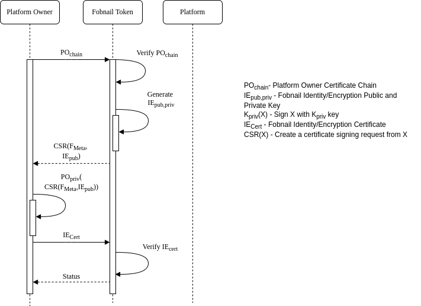
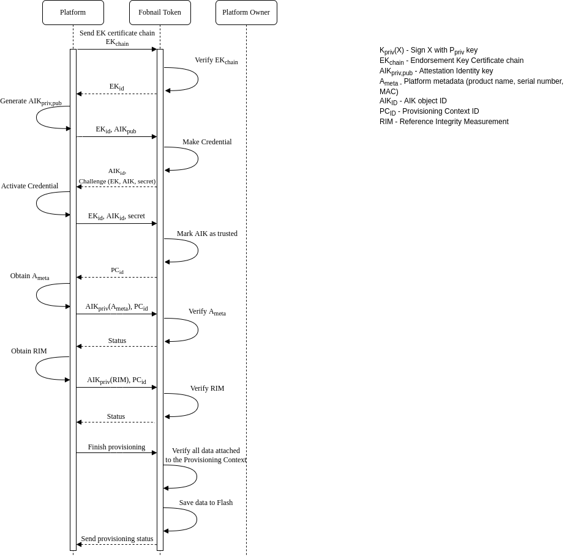

# Fobnail architecture

## Fobnail provisioning

The purpose of provisioning is to provide a controlled process for an
individual to take ownership and configure the Fobnail. During
the provisioning process the token should provide the following information
to the provisioner:

* A public key to use for generating an identity certificate
* A public key to use for generating an encryption certificate
* Metadata about the token, e.g. model, serial number, etc

A token will consider itself provisioned when it is in an unprovisioned state
and a provisioner sends it the following information:

* A certificate chain for the provisioner
* An identity certificate containing the public key the token generated
* An encryption certificate containing the public key the token generated

Either during provisioning or post provisioning a provisioner may send the
following information,

* RIM Database
* Policy Database
* Attestation Protected Object

This information must be signed by private key for the provisioner identity
certificate contained in the provisioner Certificate Chain.

### Fobnail provisioning diagram

---

## Platform provisioning

Fobnail architecture consists of two main functionalities - provisioning and
attestation. We need to provision a Fobnail token and platform. The
platform provisioning is split into remote provisioning and local
provisioning. During the remote provisioning, the platform can connect to
the platform owner. The platform owner verifies the platform state and provides
the RIM and attestation policies to the Fobnail token. The platform receives an
attestation identity certificate that specifies the platform. The certificate is
based on platform metadata (CPU serial, MAC) and the AIK public part.

### Remote platform provisioning diagram

In the case of local provisioning, the Fobnail token takes the platform
owner role. The Fobnail token does not receive the policies, and default
policies are used during the attestation.

### Local platform provisioning diagram

---

## Attestation

Fobnail role in the attestation of a system is to evaluate an Attestation
 Token and arrive at a decision whether the attested platform represents
a good state. Fobnail is not an enforcement point for this decision and can
only provide a physical and digital response to convey its decision. The
physical response assumes that a user is monitoring the Fobnail Token and will
take appropriate enforcement action(s). A digital response comes in the form
of an Authorization Token that is returned back to the system. The assumption
here is that the Authorization Token can securely be used by the system to
enforce the decision or forwarded to an external entity that can enforce
the decision.

### Attestation diagram

