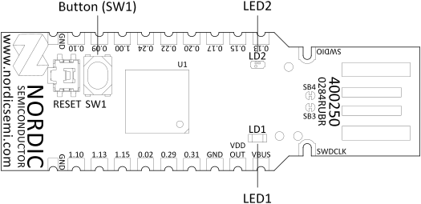

# Fobnail blink codes

One of the main advantages of using hardware dongle for attestation is that it
can report the state to users without relying on proper functioning of PC (or
another device) being attested. This is done by various blink codes representing
different states of Fobnail Token operation.

Even though LED2 on nRF52840 dongle is a multicolor RGB LED, Fobnail only uses
red in order to not exclude users with impaired color vision. LED1 is green.
Unless noted otherwise, short blinks and intervals between blinks take 100 ms.

## Idle states

#### Token not provisioned

Red LED will be lit indefinitely.

#### Token provisioned, waiting for CoAP client

Both LEDs will shortly blink every 5 seconds. Cycle starts with blink, followed
by a waiting period, so any LED failure should be visible when provisioned Token
is connected to the device.

## Fobnail provisioning

On successful Token provisioning, green LED will blink once. No change on
failure, i.e. red light will be kept on.

## Platform provisioning

On successful Token provisioning, green LED will blink three times. After
failure followed by client disconnection Token goes back to waiting state, i.e.
both LEDs will blink every 5 seconds.

## Attestation

Note that Fobnail is exposed to OS as network device. As such, there may be
multiple clients connected to it, even from another devices in local network,
assuming proper (or improper, depending on use case) routing. One implication
is that following states are not mutually exclusive, success and failure may be
reported simultaneously.

#### Success

Green LED will be lit as long as any successfully attested client is connected
and has access to [Fobnail Token Services](fobnail-api/#fobnail-token-services).
Client is considered disconnected after 3 seconds of inactivity.

#### Failure

Red LED will be lit for 5 seconds.
