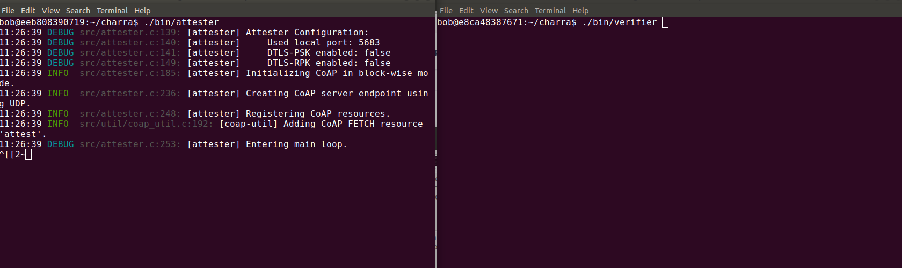
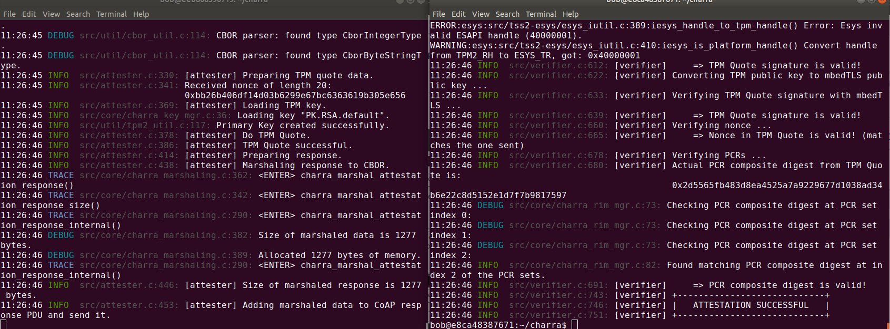

# How to run CHARRA concept on PC

The detailed steps of how to build and run CHARRA applications (Attester and Verifier) are
discribed on corresponding GitHub repository:
 - [Build and run CHARRA on PC](https://github.com/Fraunhofer-SIT/charra#build-and-run)

In general there are two common ways to reach the goal:
* Build docker container with binary packages
* Build neccessary packages from sources inside docker container

The first path is faster and more preferable. When the project is built one may run and test
Attester and Verifier application:
1. Configure network for docker in order to allow communicate containers.
E.g. Edit file ./docker/run.sh and add internal virtual network:
```
--network=charra_default
```
to docker run command
2. Specify IP address of Attester in file src/verifier.c (char dst_host[16] in src/verifier.c)
and rebuild to project in container:
```
cd charra
make
```
3. Run Attester and Verifier on two different consoles:

4. Got the result.



