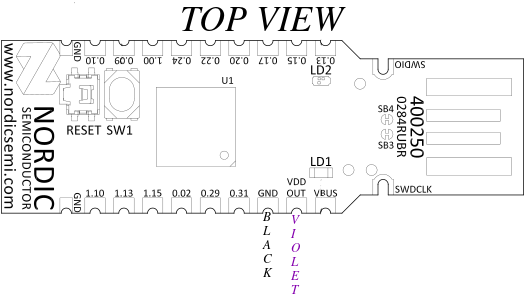

# Debugging nRF52840 dongle

It is possible to debug the nRF82540 dongle wit ha JLink debugger. The dongle
contains a depopulated JLink header and a 10 pads for connecting the ribbon
needle connector or a straight ribbon.

## Prerequisites

For this purpose we will need:

- nRF82540 Development Kit (PCA10056)
- [Needle 10-pin cable with ribbon 1.27mm pitch](https://www.tag-connect.com/product/tc2050-idc-nl-050-all)
  for use with Development Kit

One may use a JLink pro with a suitable adapter to the correct ribbon cable
with needle connector. However JLink PRO is very expensive (25x more expensive
than development kit).

Also if using a development kit, it only uses a voltage o 3V to program and
debug applications so we need to slightly modify the dongle for development kit
use.

1. Firstly cut the SB2 and solder SB1. This will allow to use VDD_OUT pin as a
   power source.
   
2. Solder jumper wires (male-end) to the following pads (color convention may
   be different, but in the whole documentation we will use the following color
   convention):
    Description:
   - black wire - male-male jumper wire (GND)
   - violet - male-male jumper wire (VDD_OUT)

> IMPORTANT! Do not connect the dongle to USB when SB2 is cut and SB1 is soldered.

## Connection

How does it work? The nRF82540 development kit can program external chips via
the `debug out` connector. In order to program the nRF52840 dongle:


1. Connect Needle 10-pin cable with ribbon 1.27mm pitch to the debug out
   header. The ribbon has an edging which fits into the header only in one
   orientation.
2. Connect black write from the dongle to one of the red GND pin on the female
   header on the left (according to picture). Connect the violet wire from the
   dongle to the red VDD pin on the female header on the left (according to
   picture). The development kit will source VDD power 3V which is suitable for
   the programming with the development kit. The dongle automatically uses 5V
   on the VDD and VBUS' (connected to EXT_GND_DETECT) which will damage the dev
   kit. Also the dev kit selects which chip to program based on the power
   supply of the target chip:
   - if VDD is present on the debug out connector then the external chip is
     programmed
   - otherwise the dev kit's on-board chip is programmed
   So in order to program the dongle with the dev kit we have to supply
   compatible voltage from the dev kit to the dongle. That is why the dongle
   required modifications to source power from VDD_OUT pin.
3. Connect the needle 10-pin cable with ribbon 1.27mm pitch to the JLink
   connector on the dongle (see picture below, marked in red). The needle has 3
   positions pins which will fit in a single orientation only.
   

## Programming and recovery

Now that we have prepared correct connections between dev kit and the dongle we
may proceed with flashing. For example if we erase whole chip along with UICR
which sets the voltage regulator on the dongle we will not be able to program
it via dev kit unless we do the modifications described before. The nRF52840
chip on the dongle hardware is configured in high voltage mode. This uses REG0
to lower the chip supply voltage (VDD), and the default value is 1.8 V,
configured by the REGOUT0 register in UICR. This is too low to be used with the
on-board programmer on the nRF52840 DK, so erasing or programming with a
firmware that does not configure the regulator for a higher VDD will leave it
in a state where it cannot be re-programmed from a dev kit.

To avoid problems if you are using a debugger without level shifter (such as a
nRF52840 DK):

- Avoid erasing the UICR of the chip (i.e. do not do a full chip erase).
- If you must erase the UICR, make sure that you do not reset the board until
  after you have programmed either REGOUT0 directly or firmware that sets it.
- Alternatively, modify the dongle as explained under External regulated source
  and supply the dongle directly from the nRF52 DK (assuming it is used as a
  debugger).

In our case we have done the modifications and will recover the original
bootloader:

1. `wget https://devzone.nordicsemi.com/cfs-file/__key/communityserver-blogs-components-weblogfiles/00-00-00-00-13/pca10059_5F00_bootloader.zip`
2. `unzip pca10059_5F00_bootloader.zip`
3. Copy the file
   `graviton_bootloader_mbr_v1.0.1-[nRF5_SDK_15.0.1-1.alpha_f76d012].hex` into
   the directory mounted inside thee fobnail-sdk container.
4. Grab the dongle with needle and hold it tight so that the needle will
   connect with the pins.
5. Execute `nrfjprog -f NRF52 --program graviton_bootloader_mbr_v1.0.1-[nRF5_SDK_15.0.1-1.alpha_f76d012].hex --chiperase`
6. Disconnect the needle and the wires from dongle and devkit.
7. Connect violet and green wire.
8. Plug the dongle into computer USB port while holding reset button. Check if
   the LED diode is blinking red which indicates teh original bootloader mode
   has been entered. Also the `dmesg` that the USB Nordic bootloader has been
   detected.

## Debugging

There is an incompatibility in the debug header of the dongle and dev kit:


The 5th pin of debug out header (second picture) is connected the the dev kit's
ground, while 5th pin on the JLink header on the dongle is connected to VBUS'
which is 5V when the dongle is connected to the USB. This makes the debugging
of the dongle effectively impossible when the dongle is connected to the USB
port. However, when it is supplied with power via VDD_OUT, it is possible to
debug it, but it will be impossible to debug USB connection. The right way to
debug the dongle without modifications is to use the P1 header on the dongle
which matches 100% the pinout of debug out header of the dev kit. Note that the
modifications are still needed if the UICR is removed to supply the VDD of the
dongle with 3V from dev kit.

In order to connect to the P1 header one would need a SMT 2x5 pin header pitch
1.27mm, the same as used on the debug out header on the dev kit. Here you may
find big pictures of such header:
https://blog.adafruit.com/2019/01/17/new-product-mini-swd-0-05-pitch-connector-10-pin-smt-box-header/

Until we do not need to debug USB connection, we may use a blinky sample as a
reference program to be debugged. Refer to [Flashing sample applications](flashing_samples.md)
how to build the samples. Now we will try to flash them with the needle
connector instead of USB DFU. Inside the fobnail SDK container execute:

1. `make clean`
2. `make mcuboot_demo`
3. `make blinky_demo`
4. Ensure the chip is erased (ti simulate a fault and that we lost UICR) so
   connect the black and violet wires to the dev kit's GND and VDD, grab the
   dongle with needle and hold it tight so that the needle will connect with
   the pins. Execute `make erase`.
5. Flash the nRF52840 dongle while holding the needle:
   ```
   nrfjprog -f NRF52 --program graviton_bootloader_mbr_v1.0.1-\[nRF5_SDK_15.0.1-1.alpha_f76d012\].hex 
   ```
6. Unplug and plug the violet wire to dev kit's VDD. This will initiate a reset
   of the dongle (the Jlink header does not expose reset signal, only P1 header
   has reset signal).
7. Notice the red LED should start blinking indicating Nordic's bootloader
   mode. It has entered the bootloader mode automatically because USB
   connection has not been detected thus the rest switch was not needed.
8. Solder SB2 and desolder SB1. Unplug black and violet wires. Unplug the
   needle connector. Black wire floating safely.
9. Plug the dongle into USB and flash the samples using DFU as instructed in
   [Flashing sample applications](flashing_samples.md).

Since the Nordic's bootloader is stuck when not connected to USB, and we cannot
use dev kit to debug when dongle is connected to USB, the guide below presents
how to debug a blinky sample on the nRF82540 chip present on the dev kit.
Although it will apply to the dongle as well if you solder the P1 header and
connect the straight ribbon cable to debug out and P1 header. If you have a
straight ribbon cable and P1 header soldered you may use the dongle instead.

1. Disconnect the dongle from the dev kit.
2. `west build -b nrf52840dk_nrf52840 -d build/blinky zephyr/samples/basic/blinky`
3. `nrfjprog --eraseall -f nrf52`
4. `nrfjprog -f nrf52 --program build/blinky/zephyr/zephyr.hex`
5. Now the green LED1 on the dev kit should start blinking.
6. Launch JLink GDB server inside the container:
   ```
   JLinkGDBServerCLExe -select USB -device nRF52840_xxAA -endian little \
       -if SWD -speed 4000 -ir -noLocalhostOnly &
   ```
7. Connect with GDB to the nRF52840 chip on the dev kit:
   ```
   gdb
   (gdb) file build/blinky/zephyr/zephyr.elf
   (gdb) target remote localhost:2331
   ```
8. Execute the following commands in GDB to start debugging [TBD]
