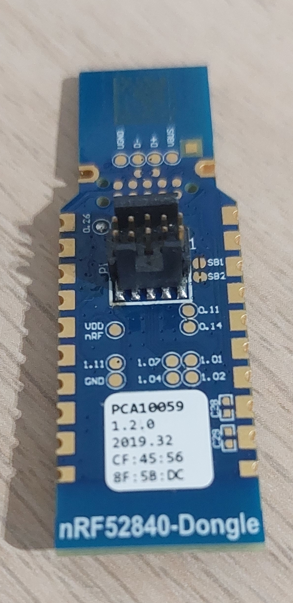

# Flashing sample applications

## Required hardware

You need following hardware to flash apps:

- [nRF52840 dongle](https://www.nordicsemi.com/Products/Development-hardware/nrf52840-dongle) -
  this is the target device on which Fobnail firmware runs.

- [nRF52840-DK](https://www.nordicsemi.com/Products/Development-hardware/nrf52840-dk) -
  development board used for dongle flashing and debugging.

- [SWD Cable](https://www.adafruit.com/product/1675) - 2x5 1.27 mm pitch IDC
  cable used for connecting dongle to debugger.

- [Adafruit 4048 header](https://www.adafruit.com/product/4048) - nRF dongle
  comes without SWD header, so it must be soldered. This is the same header as
  used in nRF52840-DK board.

When soldered, 4048 header's notch must face direction opposite to USB plug.



## Preparing debugger

We use `cargo-embed` for firmware flashing and debugging, which internally uses
`probe-rs`, so you need a compatible debugger. We are using
[nRF52840-DK](https://www.nordicsemi.com/Products/Development-hardware/nrf52840-dk)
development board, which exposes a JLink-compatible interface. To check whether
your debugger is supported, connect the development kit to your PC with USB
cable, [start Fobnail SDK](/fobnail-sdk.md) and run `probe-rs-cli list`. You
will see output similar to this:

```
The following devices were found:
[0]: J-Link (J-Link) (VID: 1366, PID: 1015, Serial: 000683081460, JLink)
```

If `probe-rs` does not detect debugger, that could mean it is not supported. You
can set `RUST_LOG=trace` environment variable to retry scanning with debug
output enabled.

For debugger to work, you need to add an Udev rule granting you correct
permissions:

```
SUBSYSTEM=="usb", ATTR{idVendor}=="1366", ATTR{idProduct}=="1015", OWNER="akowalski", MODE="0660"
```

Replace `idVendor` and `idProduct` and `OWNER` with correct VID, PID and your
user name, save this to `/etc/udev/rules.d/99-usb.rules`, then run
`sudo systemctl reload systemd-udevd` to apply these rules without rebooting.

## (Optional) Building and flashing blinky sample

In order to flash a sample application on the nRF52840 dongle we will use
blinky sample application from our [nrf-hal](https://github.com/fobnail/nrf-hal)
fork. Follow the steps below to build and flash blinky sample:

1. Power on dongle and connect it to debugger.
2. Go to `nrf-hal` directory
3. Run the fobnail-sdk container with `run-fobnail-sdk.sh`.
4. Go to `examples/blinky-demo-nrf52840`
5. Execute `cargo embed --target thumbv7em-none-eabihf`. This command will build
   the sample app, flash it onto target device and spawn RTT console (sort of
   UART-over-JTAG).
6. Both green and red LEDs should start blinking, you should see RTT console
   with similar message:
   ```
   10:31:50.887 Blinky demo starting
   ```

## Summary

Cargo-embed provides great tools with very comfortable single-command solution
for building and testing firmware.
