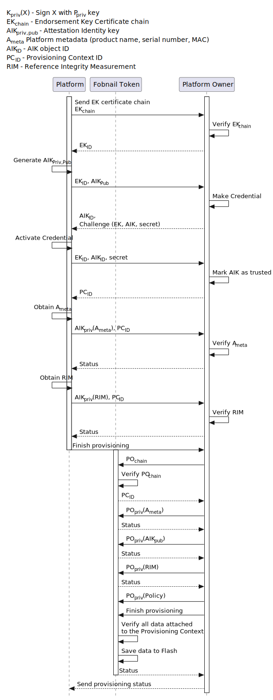

# Summary

Change Fobnail architecture - instead of having the server on the Attester and
client on Fobnail Token, the server would be located on Fobnail Token and the
client on Attester.

# Motivation

The current architecture severely limits Fobnail Token configuration abilities
due to Fobnail Token being a client. Fobnail Token has hardcoded paths for
performing provisioning and attestation. We are not capable of sending requests
to Fobnail Token, which severely limits the amount of configuration possible,
e.g., a once provisioned platform can not be unprovisioned without resetting
Fobnail Token into factory state. Fobnail Token configuration cannot be changed
without resetting and going once again through the provisioning process.

It is also not possible to expose any services from Fobnail Token to Attester,
such as access to symmetric cryptographic keys or performing cryptographic
operations on behalf of Attester in case of asymmetric cryptography. Such an API
is a must for features like disk encryption or Fobnail-based authentication to
services like VPN.

Switching to a server-based Fobnail Token allows exposing services for
accessing cryptographic keys and performing administrative tasks.

# Architecture change proposal

## Fobnail Token provisioning

Currently, if in an unprovisioned state, Fobnail Token initiates provisioning by
requesting PO certificate chain from the Platform Owner and verifies PO
certificate chain against a trusted certificate embedded into Fobnail firmware.
If verification passes, Fobnail generates Identity/Encryption keypair and
requests PO to generate Identity/Encryption certificate. Retrieval of valid
Identity/Encryption certificate finalizes provisioning process.

Instead, we propose the following protocol:
1. Unprovisioned Fobnail Token awaits for client (Platform Owner) to commence
   provisioning by sending its certificate chain.
2. Fobnail verifies certificate chain against trusted certificate embedded into
   its firmware. If verification is succesful, Fobnail generates
   Identity/Encryption keypair and responds with a Certificate Signing Request.
3. Platform Owner finalizes configuration by sending certificate generated from
   previously provided CSR.
4. Fobnail Token verifies and saves certificate and provided configuration to
   its internal memory, then locks configuration and sends status to Platform
   Owner, finalizing provisioning process.
5. Token can be unlocked only by reset, which wipes out all configuration,
   provisioned platforms and all keys.

## Local platform provisioning

Platform provisioning doesn't change much, except that the process is initiated
by the Attester instead of the Fobnail Token. To protect against platform
re-provisioning itself, Fobnail Token must require user consent to provision a
new platform, presumably by pressing a button for a few seconds. As an
additional security measure, platform provisioning could be lockable through
Fobnail Token APIs.

Previously all requests were sent in a specific order, but since Fobnail Token
will be a server now, and the client is free to send requests in any order, the
server must handle this case. We want to reduce the amount of global state we
keep, so all APIs should take everything required to complete operation as a
parameter. Fobnail Token may cache some objects in memory, like EK or AIK, so we
are introducing object IDs that are used to reference Fobnail Token objects.
Each object is temporary and is kept at most as long as the client is connected
to the server. Server regularly issues CoAP ping requests to check client
connectivity.

1. Attester starts provisioning by sending its EK certificate chain.
2. Fobnail Token verifies certificate chain and sends EK object ID in response.
3. Attester generates and sends AIK together with EK object ID.
4. Fobnail Token responds with AIK challenge and AIK object ID.
5. Attester performs Credential Activation using the provided challenge and
   sends results to Fobnail Token with EK object ID and AIK object ID.
6. Fobnail Token verifies the results of Credential Activation. If verification
   is successful, AIK is marked as trusted, and Fobnail Token creates
   Provisioning Context and sends its ID (PC ID) to the client.
7. Attester signs and sends its metadata to the Fobnail Token, together with PC
   ID. Fobnail Token verifies metadata signature against AIK bound to specified
   Provisioning Context.
8. Fobnail Token verifies metadata and returns status. Metadata is bound to the
   specified Provisioning Context.
9. Attester sends RIMs.
10. Fobnail verifies RIMs and returns status. RIMs are bound to the Provisioning
    Context.
11. At this point, additional calls may be issued to send more data. This
    feature is left for future provisioning extensions.
12. Attester finalizes platform provisioning by sending a special request.
13. Fobnail verifies all the data bound to the Provisioning Context (AIK and
    RIMs currently), saves it to flash, and sends the final status.
14. Platform is provisioned now.

## Remote platform provisioning

During remote platform provisioning, the Platform Owner is responsible for
communicating with provisioned Platform, verifying TPM (EK certificate and AIK
challenge), and receiving and verifying RIMs. Fobnail's sole responsibility is
to accept the configuration provided by the Platform Owner, which completes the
provisioning process.

Fobnail Token is inserted into Platform Owner during provisioning, and the
provisioned Platform is remote. Provisioning must always be performed in a
secure, internal network. For establishing a secure connection, SSH or VPN may
be used. To initiate the provisioning process, one must connect to the target
Platform over SSH and manually trigger provisioning by connecting to Platform
Owner's CoAP server.

1. Attester starts provisioning by sending its EK certificate chain.
2. Platform Owner verifies certificate chain and sends EK object ID in response.
3. Attester generates and sends AIK together with EK object ID.
4. Platform Owner responds with AIK challenge and AIK object ID.
5. Attester performs Credential Activation using the provided challenge and
   sends results to Platform Owner with EK object ID and AIK object ID.
6. Platform Owner verifies the results of Credential Activation. If verification
   is successful, AIK is marked as trusted, and the Platform Owner creates
   Provisioning Context and sends its ID (PC ID) to the client.
7. Attester signs and sends its metadata to the Fobnail Token, together with PC
   ID. Platform Owner verifies metadata signature against AIK bound to specified
   Provisioning Context.
8. Platform Owner verifies metadata and returns status. Metadata is bound to the
   specified Provisioning Context.
9. Attester sends RIMs.
10. Platform Owner verifies RIMs and returns status. RIMs are bound to the
    Provisioning Context.
11. At this point, additional calls may be issued to send more data. This
    feature is left for future provisioning extensions.
12. Attester finalizes platform provisioning by sending a special request.
13. Platform Owner verifies all the data bound to the Provisioning Context (AIK
    and RIMs currently)
14. Platform Owner sends its certificate chain to Fobnail Token.
15. Fobnail Token verifies certificate chain and returns Provisioning Context
    ID.
16. Platform Owner signs the Platform metadata with private matching the leaf
    certificate (sent as part of the chain in the previous step) and sends
    signed Platform metadata to Fobnail Token.
17. Fobnail Token verifies metadata signature and sends status.
18. Platform Owner sends signed RIMs to Fobnail Token.
19. Fobnail Token verifies RIMs signature and responds with status.
20. Platform Owner sends (signed) policy to Fobnail Token.
21. Fobnail Token verifies policy and responds with status.
22. At this point Platform Owner may issue additional calls to send more data.
    This feature is left for future provisioning extensions.
23. Platform Owner completes provisioning by sending a special request.
24. Fobnail verifies all the data bound to the Provisioning Context (AIK and
    RIMs currently), saves it to flash, and sends status.
25. Platform Owner sends the final status to the provisioned Platform.
26. Platform is provisioned now.

Remote attestation doesn't differ in anything from the Attester's point of view,
and the protocol is exactly the same as if Attester has spoken directly to the
Fobnail Token.

## Platform attestation

Since Fobnail Token is a server, the attestation must be requested by Attester.
After plugging Fobnail Token into USB, the attestation must start and complete
within a defined amount of time. Otherwise, Fobnail Token will consider the
Platform untrustworthy.

1. Attester starts attestation by sending signed platform metadata to Fobnail
   Token.
2. Fobnail Token verifies metadata and returns Attestation Context ID together
   with PCR selection and nonce.
3. Attester does TPM quote with its AIK, Fobnail Token provided PCR selection
   and nonce. Result is sent to Fobnail Token, to appropriate Attestation
   Context.
4. Fobnail Token performs Evidence Appraisal and returns trust decision to the
   Attester.
5. Fobnail Token unlocks access to keys stored in the flash.

# Fobnail Token services

Fobnail services include, among others, access to protected files and keys.
Access is granted only to a platform that has passed attestation. Additional
security measures could be imposed for finer-grained control where each key
access would have to be granted to each Platform.

Secure files can be read, written, or deleted. The primary usage for this
feature is to keep keys that should be possible to read back, e.g., disk
encryption keys (having Fobnail Token do all crypto on behalf of Platform would
result in too high performance hit).

Keys, once written, can not be retrieved (neither symmetric nor asymmetric). In
the case of symmetric keys, Fobnail Token exposes API to encrypt and decrypt
data using these keys. In the case of asymmetric keys, Fobnail Token exposes API
to decrypt or sign data using a private key and to read the public key. The
Platform is responsible for performing cryptographic operations on the public
key.

Due to Fobnail Token being exposed as a server over a (local) network, it could
be accessed by any unprivileged application (just with access to the network
stack). All requests must be signed with AIK to prevent any application from
accessing Fobnail Token Services. The requirement to sign with AIK limits access
to applications with access to TPM.
